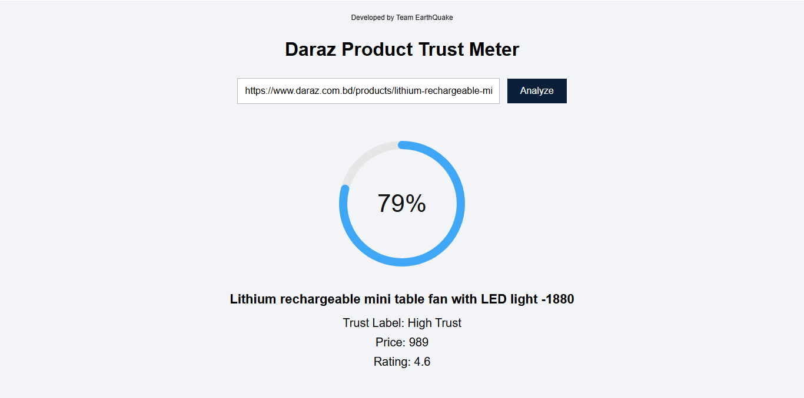

# 🛡️ Daraz Product Trust Meter


An AI-powered web tool that analyzes Daraz product reviews and calculates a **Trust Score** using **sentiment analysis, product ratings, and review volume**.

This system helps users quickly evaluate whether a product is **trustworthy or risky** based on real customer feedback.

---

## 🚀 Features

✔ Scrapes **Daraz product information**  
✔ Extracts **customer reviews automatically**  
✔ Performs **AI-based sentiment analysis**  
✔ Calculates a **Trust Score (0-100)**  
✔ Displays **Trust Label (High / Medium / Low Trust)**  
✔ Clean **interactive trust meter UI**  
✔ Built using **FastAPI + JavaScript**

---

## 🖥️ How It Works

1. User pastes a **Daraz product URL**
2. The system **scrapes product reviews**
3. Reviews are analyzed using **sentiment analysis**
4. A **Trust Score** is calculated
5. The result is shown using a **visual trust meter**

---

## 📊 Example Output

Trust Score: 77%  
Trust Label: High Trust  

Title: Matte Premium Acoustic Guitar - Edition 2024  
Rating: 4.4

---

## 🏗️ Project Structure

daraz-trust-meter  
│  
├── main.py  
├── scrape.py  
├── senti.py  
├── trust.py  
├── requirements.txt  
│  
└── templates  
  └── index.html  

---

## ⚙️ Installation

Clone the repository:

```
git clone https://github.com/mahabub-rah/Daraz-Product-Trust-Meter
cd Daraz-Product-Trust-Meter
```

Install dependencies:

```
pip install -r requirements.txt
```

Run the application:

```
uvicorn main:app --reload
```

Open your browser:

```
http://127.0.0.1:8000
```

---

## 📦 Dependencies

Example `requirements.txt`

fastapi  
uvicorn  
requests  
beautifulsoup4  


---


Render start command:

```
uvicorn main:app --host 0.0.0.0 --port 10000
```

---

## 🔮 Future Improvements

Possible upgrades:

- Fake review detection
- Review spam filtering
- Product image extraction
- Sentiment trend visualization
- Multi-platform support (Amazon, Daraz, Alibaba)

---

